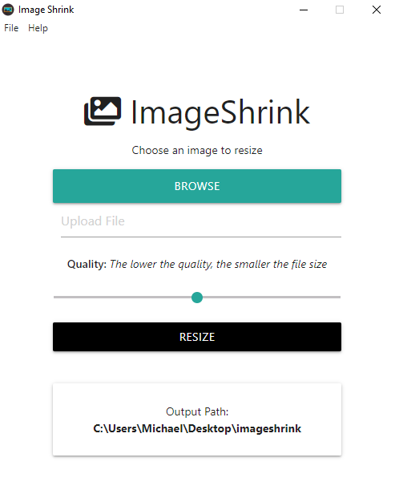
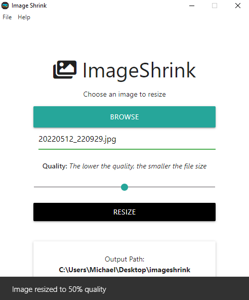

# Image Shrinker Application in Electron 20

<p align="center"></p>
<p align="center"></p>

## Project Setup

- Create a `package.json` file using `npm init`
- Install Dev Dependencies
  - `npm i -D electron`
- Create a `start` script in `package.json`
  - `"start": "electron ."` which will run the `main.js` file
  - Create a `main.js` file
  - Test the file by adding a console.log and running `npm start`
- Create an `app` folder and `index.html` file -> kind of like a frontend app
- Build out the `main.js` file and load in the local file from the `app` (the `index.html` file)
- Beware of the console log message
  > Electron Security Warning (Insecure Content-Security-Policy) This renderer process has either no Content Security
  > Policy set or a policy with "unsafe-eval" enabled. This exposes users of
  > this app to unnecessary security risks.
- To solve this issue, see [Security](https://www.electronjs.org/docs/latest/tutorial/security) add the following CSP Policy to the `index` file:

```javascript
<meta
  http-equiv="Content-Security-Policy"
  content="script-src 'self' 'unsafe-inline'"
/>
```

- Use `mainWindow.loadFile('.app/index.html')` to load the `index.html` file
- Use `nodemon` or `electron-reload` to watch for changes in the `index.html` file and autoreload file
  - `npm i -D nodemon` to install nodemon as a Dev Dependency
  - Add `"dev": "nodemon --exec electron ."` to the scripts in `package.json` file
    - Use ctrl+ s to save the file
    - Use ctrl+r to reload the file

## Considerations

### Absolute Icon Paths

- Images added need to be defined by absolute path which becomes especially important when you package the application. i.e. from
  - `./assets/icons/Icon_256x256.png`
  - to
  - `${__dirname}/assets/icons/Icon_256x256.png`

# Packages

- [x] [imagemin@7.0.1](https://www.npmjs.com/package/imagemin/v/7.0.1) - Minify images seamlessly
- [x] [imagemin-mozjpeg@8.0.0](https://www.npmjs.com/package/imagemin-mozjpeg/v/8.0.0) - Imagemin plugin for mozjpeg
- [x] [imagemin-pngquant@8.0.0](https://www.npmjs.com/package/imagemin-pngquant/v/8.0.0)
- [x] [slash@3.0.0](https://www.npmjs.com/package/slash) - Convert Windows backslash paths to slash paths
- [x] [electron-log@^4.1.2](https://www.npmjs.com/package/electron-log)
- [x] [electron-packager@14.2.1](https://www.npmjs.com/package/electron-packager/v/14.2.1)

# Run the Application

- `npm start` to run the application
- `npm run dev` to run the application in development mode with nodemon

# Build the Application

- Run `npm run build-package-win` to build for windows. Alternatively, you can run `npm run build-package-mac` to build for mac and `npm run build-package-linux` to build for linux.

# Open the Executable Application

- Open `ImageShrink.exe` inside the `released-builds` folder
